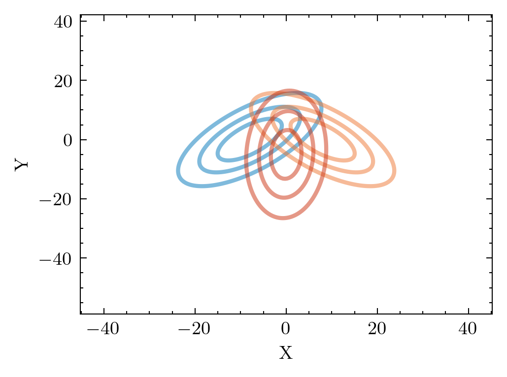
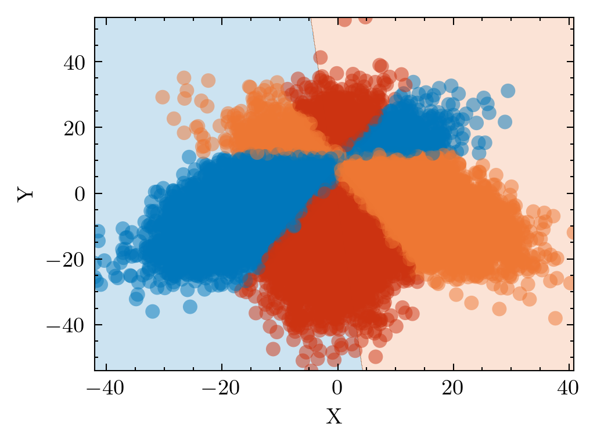
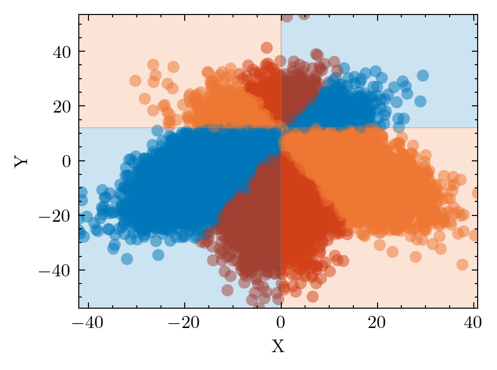
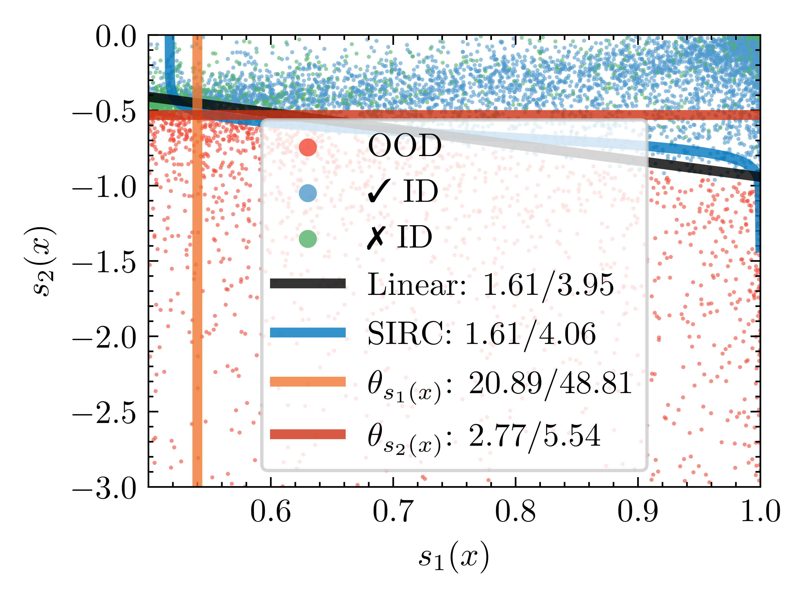

# Theoretically Grounded SCOD - Evaluation
This repository contains a Python library for evaluating results exported by OpenOOD using double-score strategies.

## Installation
Use Anaconda to install all dependencies of the project (including dependencies of the training scripts).

```bash
$ conda env create --file environment.yaml
```

# Usage
## Real-World Data  
The central script in this repository is `compute_tables.py`. It processes data in the format exported by the OpenOOD framework. It constructs a double-score strategy; both SIRC and Linear; and evaluates the performance of such strategies on the SCOD (Selective Classification in presence of Out-of-distribution Data) problem. The primary metric for evaluation is the area under the SCOD RISK - TPR curve.

For instance, to evaluate ImageNet-1K results, use the following command, specifying the main method and the desired ignored methods.
```bash
$ python compute_tables.py \
    --base_dir OpenOOD/results/imagenet_resnet50_tvsv1_base_default \
    --id_dataset imagenet \
    --main_method msp \
    --ignored_methods ash react residual
```

Similarly, for CIFAR-100 experiments:
```bash
$ python compute_tables.py \
    --base_dir OpenOOD/results/cifar100_resnet18_32x32_base_e100_lr0.1_default \
    --id_dataset cifar100 \
    --main_method msp \
    --ignored_methods knn
    --multisplit
```

And for CIFAR-10 experiments:
```bash
$ python compute_tables.py \
    --base_dir OpenOOD/results/cifar10_resnet18_32x32_base_e100_lr0.1_default \
    --id_dataset cifar10 \
    --main_method msp \
    --ignored_methods knn
    --multisplit
```

Running these scripts requires the installation of the OpenOOD benchmark and downloading all of the necessary datasets (e.g., ImageNet, NINCO, SSB_Hard, etc.). To allow users exploration of the repository without prior OpenOOD installation, we provide a script for generating synthetic data. Below is a complete example demonstrating the generation and evaluation of synthetic data.

## Synthetic Example
### Step 1: Generating the Data
To run the provided scripts using synthetic data, we first need to generate some data. The synthetic data is produced by three 2D Gaussians. Two Gaussians represent distinct ID classes (blue and orange, refer to the Figure below), while the red Gaussian represents the out-of-distribution (OOD).



We sample data from the distributions and train a simple logistic regression model which distinguishes between the two ID classes. We visualize the data and the learned decision boundary in the Figure below. The first image shows the classifier $h(x)$, the second image shows the Bayes optimal classifier $h^*(x)$.

<p float="left">
  
   
</p>

We use the classifier $h(x)$ to obtain the MSP score. We use the exact p.d.f. knowledge to obtain the true conditional risk, the likelihood $p_I(x)$ and the likelihood ratio $g(x)=\frac{p_O{x}}{p_I(x)}$.

The script to achieve this is as follows:
```bash
$ python generate_synthetic_data.py
```

This script generates a new directory named `synthetic_example` containing three folds of synthetic results, each with MSP, conditional risk, likelihood ratio $g(x)$, and likelihood $p_I(x)$ scores.

### Step 2: Visualizing the Double-Score Strategies
To visualize the double-score strategies (as in our paper), execute the following command:

```bash
$ python visualize_double_score_strategies.py
```

The resulting visualization displays the ID and OOD data in the 2D space of the component scores $s_1(x)$ and $s_2(x)$. Additionally, it showcases the decision boundary of the two double-score strategies and the decision boundaries of the two single-score strategies using only $s_1(x)$ or $s_2(x)$.



### Step 3: Evaluating the Double-Score Strategies
Finally, to assess the performance of SIRC and linear combination on the SCOD problem, run the following script:

```bash
$ python compute_tables.py \
    --base_dir synthetic_example \
    --id_dataset gauss \
    --main_method cond_risk \
    --multisplit
```

Executing this script creates a new directory output/results, populated with tables (for each fold) containing the metrics achieved by different strategies. An example of such Table is shown below.

|                      | msp                  | lhood_ratio          | lhood_id            |
|----------------------|----------------------|----------------------|---------------------|
| score_1              | cond_risk            | cond_risk            | cond_risk           |
| score_2              | msp                  | lhood_ratio          | lhood_id            |
| beta                 | 0.5                  | 0.5                  | 0.5                 |
| score_1_AUROC        | 0.6134787540024595   | 0.6134787540024595   | 0.6134787540024595  |
| score_1_AURC         | 0.03129400833228521  | 0.03129400833228521  | 0.03129400833228521 |
| score_1_AUJRT        | 0.20890762716491282  | 0.20890762716491282  | 0.20890762716491282 |
| score_2_AUROC        | 0.8447441997198913   | 0.9929141353291651   | 0.7666464323488396  |
| score_2_AURC         | 0.057949953059629154 | 0.04824102404429645  | 0.04063163849639895 |
| score_2_AUJRT        | 0.1066028766698689   | 0.027663444357565667 | 0.1369926030737797  |
| SIRC-plugin-AUJRT    | 0.19490861154825828  | 0.03792922861528142  | 0.19483053498047548 |
| SIRC-tuned-AUJRT     | 0.12038189113648448  | 0.016138849557634997 | 0.06040426454414761 |
| Linear-tuned-AUJRT   | 0.10344667848824361  | 0.016109939482416614 | 0.07472608571218928 |
| Linear-plugin-AUJRT  | 0.16638577666487311  | 0.017198911825782    | 0.2072106968108241  |
| multiplication-AUJRT | 0.15371912183686157  | 0.041762604236134405 | 0.1012719723326997  |

# Notes
### Notation differences from the paper
In the code within this repository, there are some notation differences compared to the paper:
- $\alpha$: Refers to the angle defining the linear double-score strategy (denoted as $\vartheta$ in the paper).
- $\beta$: Represents the relative cost of a false-positive (denoted as $\alpha$ in the paper).

### Implementation details
For SIRC the scores $s_1(x)$ and $s_2(x)$ must indicate "confidence," meaning higher scores for ID samples than OOD samples. As a result, certain adjustments to the scores are necessary. For instance, the likelihood ratio score $g(x)=\frac{p_O(x)}{p_I(x)}$ needs to be provided to SIRC multiplied by -1. These modifications are handled in our fork of the OpenOOD benchmark, where the lhood_ratio scores actually contain the score $-g(x)$. It is our intention to transfer these modifications to the evaluation script in the future, ensuring greater generality.